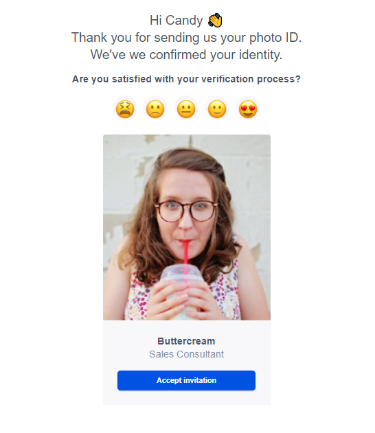

# email

## Курс вёрстки E-mail на FrontendBlok (Типичный верстальщик).

***Цель***: Изучить табличную вёрстку **E-mail** и особенности написания стилей. Практика вёрстки и адаптива.

## Посмотреть по ссылке: [E-mail](https://volkovva.github.io/email/)

